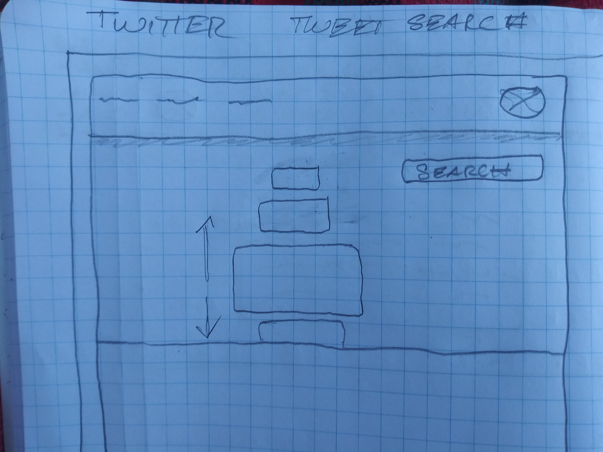

# PLANNING

## Wireframes

### HOME VIEW

### SEARCH VIEW

The vertical card carousel that changes the card size depending on its position in the parent may be a stretch goal.

### RANDOM VIEW

## Steps to Complete

### BASIC SET UP

- Create a new project with `dotnet`‘s `new React`
- Remove any React components or logic that won't be repurposed.

### USER INTERFACE

- HEADER

  - Create a Header component that imports a Nav component
  - Add Logo image or element

- NAVIGATION
  - Create a Nav component
  - Links to:
    - Home
    - Search
    - Random
  - Add Logo linking to Home
- HOME
  - Create a Home component with static content
- SEARCH
  - Create a Search component with static content
  - Create Tweet cards with mock response data
- RANDOM
  - Create a Random component with static content
  - Reuse Tweet card with mock random response data

### ROUTING

- Set up routing to Home
- Set up routing to Search
- Set up routing to Random

### INTERNAL API

- SEARCH
- RANDOM

### TWITTER API

- SEARCH
- RANDOM

### STYLING

- HEADER
- HOME
- SEARCH
- RANDOM

## Test Cases

- HOME:

  1.  When a USER visits the HOME page:
      - Show a site-wide navigation menu
      - Show the splash page describing the application
  2.  When a USER clicks the link for the SEARCH page:
      - Navigate to the SEARCH view
  3.  When a USER clicks the link for the RANDOM page:
      - Navigate to the RANDOM view

- SEARCH:

  1.  When a USER navigates to the SEARCH page:
      - Offer a way for the USER to search for tweets by
        - username
        - content
  2.  When a USER enters a search
      - Request relevant searches from the Twitter API
      - Display 5 - 10 tweets from the response in cards

- RANDOM:
  1.  When a USER navigates to the RANDOM page:
      - Offer a way for the USER to get a random tweet from a pre-selected set of Twitter users
  2.  When the USER requests a random tweet:
      - request a tweet from the Twitter API
      - display the response in a card

### TEST CASE PSEUDO CODE

- HOME:

  1.  When a USER visits the HOME page:
      - Show a site-wide navigation menu
      - Show the splash page describing the application
  2.  When a USER clicks the link for the SEARCH page:
      - Navigate to the SEARCH view
  3.  When a USER clicks the link for the RANDOM page:
      - Navigate to the RANDOM view

- SEARCH:

  1.  When a USER navigates to the SEARCH page:
      - Offer a way for the USER to search for tweets by
        - username
        - content
  2.  When a USER enters a search
      - Request relevant searches from the Twitter API
      - Display 5 - 10 tweets from the response in cards

- RANDOM:
  1.  When a USER navigates to the RANDOM page:
      - Offer a way for the USER to get a random tweet from a pre-selected set of Twitter users
  2.  When the USER requests a random tweet:
      - request a tweet from the Twitter API
      - display the response in a card

## Known unknowns

- How to make a vertical card carousel >> just start with a normal page scroll view
- Routing in React >> follow the logic laid out in the .NET React app template

## Unknown unknowns

## TODO

## Googled

- `search term used`:
  - result consumed;
  - another result consumed;
