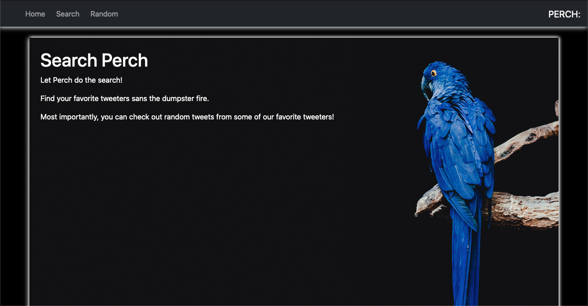

# APPLICATION #7: TWITTER API PORTAL

## A Study in Consuming Twitter‘s API's.

[View Live on Azure](https://twitterportal.azurewebsites.net/).

## Summary

This the seventh app on my roadmap part of the Software Development Mastermind program. This a reintroduction to .NET Core and C# for me. I appreciate how easy .NET makes it to set up a web app & API. The most difficult part of the project was understanding Twitter's v2 API.

The expectations for the project are described in [DELIVERABLES](./DELIVERABLES.md).

The steps I took and other errata encountered while building are in [PLANNING](./PLANNING.md). I tried my best to have the commits track closely with this document.

## Author

Scott Bergler :: Full Stack Developer > [LinkedIn](https://www.linkedin.com/in/scott-bergler/) | [Personal Website](https://oceancode.dev/)
